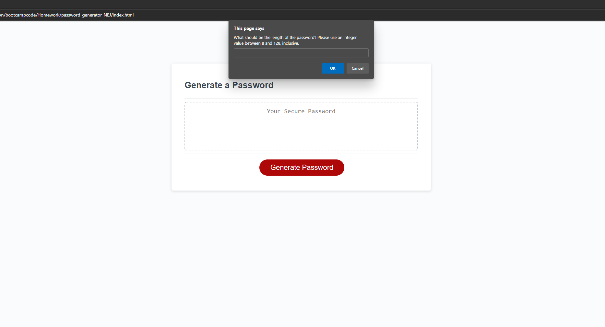

# password_generator_NEJ
-Description-
    The attached files in this repository collectively
    present a webpage able to randomly generate random
    passwords. These are generated based on the 26 letters of the english
    alphabet in either uppercase or lowercase, the numbers 0-9,
    and a limited selection of special characters.

    This attached code generates the password with a length
    given by the user, as well as user input deciding whether or
    not it will generate a password using any of the four 
    character-type options. If an invalid length is given,
    the default will be 8 characters. If all character-type
    values are rejected, it will just return 'password' with
    a notice that this was due to all characters being rejected by the user.

-Link-
    https://njscc.github.io/password_generator_NEJ/ 

-Screenshot-
    